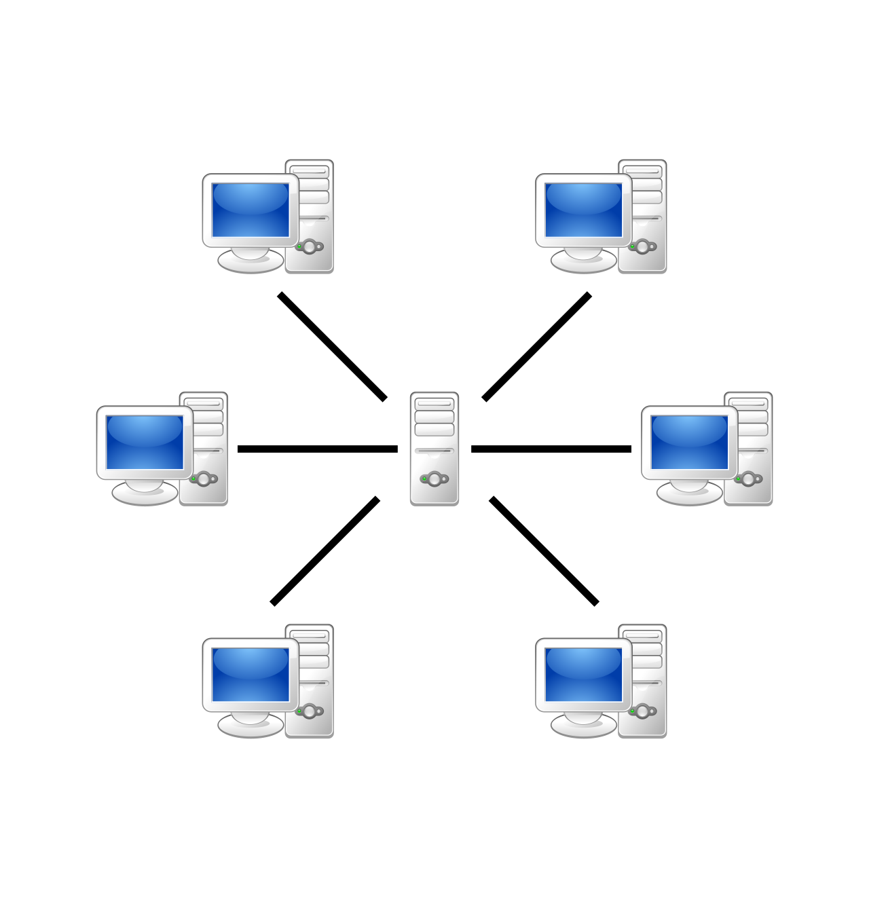

# Bootcamp 31. Node.js

## Модуль №1: Основи Node.js

### JavaScript код у браузері vs Node.js


### Створення проєкту

1. У терміналі запустити `npm init -y`. У поточній папці буде створено package.json і package-lock.json.
2. Додати файл .gitignore такого змісту:
   ```
   node_modules
   .vscode
   .idea
   ```
3. (Необовʼязково) Встановити prettier за допомогою `npm install -D prettier`.
4. (Необовʼязково) Створити файл .editorconfig (використати зразок з цього репозиторію).

## Модуль №2: створення серверних додатків, бібліотека Express

### Клієнт-серверна архітектура





### Протокол HTTP

Протокол – це спосіб комунікації, набір правил, за якими інтерпретуються повідомлення.


### Використання HTTP методів

- GET – отримати сутність.
- POST – створення нової сутності.
- PUT – створення нової або заміна наявної сутності.
- DELETE – видалити сутність.
- PATCH – оновити сутність.

### REST архітектура

REST – це скорочення від REpresentational State Transfer або "репрезентативна передача стану".
Це список принципів, яких варто дотримуватись, створюючи API.

- Клієнт-серверна архітектура
- Можливість кешування
- Можливість розділення на шари
- Незалежність запитів один від одного
- Усі ресурси можна ідентифікувати за допомогою URL і представлення ресурсу не залежить від URL
